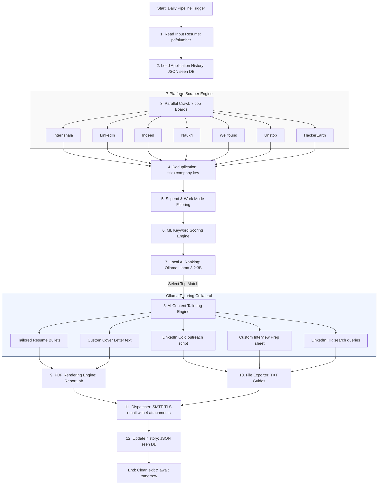

# 🚀 Internship Pipeline: Automated Job Hunting & AI Tailoring Suite

[](https://www.python.org/)
[--3b-orange.svg)](https://ollama.com/)
[](LICENSE)
[](https://www.python.org/dev/peps/pep-0008/)

**Internship Pipeline** is a highly professional, modular, production-grade automation system that crawls, filters, scores, and compiles internship opportunities. Using a **local, 100% free AI model** (Ollama `llama3.2:3b`), it tailored application documents (ATS Resumes, Cover Letters, Outreach Messages, and Interview Cheat Sheets) for the best-matched roles and dispatches them straight to your inbox daily.

Designed specifically for **Machine Learning, Generative AI, and Data Science Engineers**, this system handles the repetitive task of browsing job boards so you can focus entirely on preparation and interviews.

---

## 🏛️ System Architecture



---

## 🌟 Key Features

* **7-Platform Scraping Engine**: Dynamically crawls major job boards across target regions (Hyderabad, Bangalore, Remote) using specialized BeautifulSoup selectors, with built-in mock fallbacks to keep presentations functional during rate-limiting.
* **ML Scoring & Filtering**: Leverages a structured, weighted algorithm that scores titles and technical keywords (PyTorch, LangChain, RAG, MLflow, Docker) and filters stipends (>= Rs. 5,000/month) so you only see high-value roles.
* **Local, Secure LLM Processing**: Employs local Ollama intelligence (`llama3.2:3b`) to rank the top 3 best fits and tailor content without uploading your resume to external cloud APIs.
* **ATS-Tailored PDF Rendering**: Dynamically structures and generates stunning, recruiter-ready, single-page A4 PDFs for both resumes and cover letters using the ReportLab platypus layout.
* **LinkedIn Outreach Optimizer**: Generates ready-to-use cold outreach scripts tailored to the role and matches them with automated search links targeting recruiters, CTOs, and founders on LinkedIn.
* **Custom Interview Cheat Sheet**: Generates targeted coding questions, machine learning theory topics, and elevator pitches so you can prepare for the specific role instantly.
* **Daily Gmail Alert Dispatcher**: Automatically bundles all 4 custom documents and sends an elegant email report straight to your inbox with direct application links.

---

## 📁 Repository Structure

```text
Internship-Pipeline/
│
├── src/                        # Modular Source Code Directory
│   ├── config/
│   │   └── settings.py         # Credentials loading, target domains, and file-system paths
│   │
│   ├── scrapers/               # 7-Platform Scraper Engine
│   │   ├── base.py             # Shared work mode detection and scraper helpers
│   │   ├── internshala.py      # Internshala HTML crawler
│   │   ├── linkedin.py         # LinkedIn public job crawler
│   │   ├── indeed.py           # Indeed India job crawler
│   │   ├── naukri.py           # Naukri India job crawler
│   │   ├── wellfound.py        # Wellfound startup job crawler
│   │   ├── unstop.py           # Unstop student job crawler
│   │   └── hackerearth.py      # HackerEarth hiring challenge crawler
│   │
│   ├── scoring/
│   │   └── scorer.py           # Multi-criteria keyword scorer, dedup & stipend filters
│   │
│   ├── llm/
│   │   └── ollama_client.py    # Local Ollama client wrappers & structured templates
│   │
│   ├── storage/
│   │   ├── seen_manager.py     # Persistent JSON apply history tracker
│   │   ├── pdf_generator.py    # ReportLab document layout and styling engine
│   │   └── file_exporter.py    # Output text formatter for cold messages and interview preps
│   │
│   └── utils/
│       ├── logger.py           # Visually rich logging system (standard log file + emoji console)
│       ├── mailer.py           # MIME-SSL Gmail attachment sender
│       ├── resume_reader.py    # Robust resume text extractor with plumber fallbacks
│       └── hr_finder.py        # LinkedIn search syntax constructor
│
├── data/
│   ├── resume.pdf              # Input Resume (your standard base profile)
│   └── seen_internships.json   # JSON file keeping track of processed URLs
│
├── outputs/                    # Holds all tailored PDF/TXT files generated in runs
├── logs/                       # Folder containing runtime diagnostic logs (pipeline.log)
├── tests/                      # Python automated test suite
│   └── test_pipeline.py        # Quality assurance assertions
│
├── main.py                     # Primary entry point to trigger the workflow
├── requirements.txt            # System dependencies
├── .gitignore                  # Keeps outputs, logs, envs, and caches out of git
├── .env.example                # Configuration template
├── LICENSE                     # MIT License details
└── README.md                   # This premium repository documentation
```

---

## 🛠️ Installation & Setup

### 1. Clone & Set Up Environment
First, clone the repository and navigate to the project directory:
```bash
git clone https://github.com/adithyavaddadi/Internship-Pipeline.git
cd Internship-Pipeline
```

Create a virtual environment and install the required dependencies:
```bash
# Windows PowerShell
python -m venv .venv
.venv\Scripts\Activate.ps1

# Linux / MacOS
python3 -m venv .venv
source .venv/bin/activate

# Install requirements
pip install -r requirements.txt
```

### 2. Install & Start Ollama
Ollama runs the AI models locally on your system. 
1. Download and install Ollama from [ollama.com](https://ollama.com/).
2. Pull the lightweight, high-performance Llama 3.2 model:
   ```bash
   ollama pull llama3.2:3b
   ```
3. Start the Ollama background service:
   ```bash
   ollama serve
   ```

### 3. Set Up Local Credentials
Create a `.env` file in the project root:
```bash
cp .env.example .env
```
Open `.env` and fill in your Gmail alert details:
```env
SENDER_EMAIL=your_email@gmail.com
SENDER_APP_PASSWORD=your_16_character_app_password
RECEIVER_EMAIL=your_email@gmail.com
OLLAMA_MODEL=llama3.2:3b
```
> [!NOTE]
> **Gmail App Password**: For secure SMTP access, you must generate a 16-character App Password. 
> Go to **Google Account Settings -> Security -> 2-Step Verification -> App Passwords** to create one.

### 4. Provide Your Resume
Place your current base resume PDF file inside the `data/` folder and name it `resume.pdf`.

---

## 🚀 Usage Guide

### Triggering the Pipeline
To run the automated crawling, ranking, tailoring, and email dispatch sequence:
```bash
python main.py
```

### Running Automated Quality Tests
To execute the comprehensive unit test suite and verify imports and logic scoring:
```bash
python -m unittest discover -s tests
```

---

## 📅 Automatic Scheduling (Run Daily at 9:00 AM)

### Windows (Task Scheduler)
To run the pipeline automatically every morning on Windows:
1. Open **Task Scheduler** and click **Create Basic Task**.
2. Set Trigger to **Daily** and time to **9:00 AM**.
3. Set Action to **Start a Program**.
4. Set Program/script to point to your virtual environment's python interpreter (e.g., `D:\Adithya\AIII\.venv\Scripts\python.exe`).
5. Add arguments: `main.py`.
6. Set Start in to your project directory (e.g., `D:\Adithya\AIII`).

### Linux / MacOS (Cron Job)
To schedule execution on unix systems, open the cron editor:
```bash
crontab -e
```
Add the following line (make sure to use absolute paths):
```cron
0 9 * * * /absolute/path/to/Internship-Pipeline/.venv/bin/python /absolute/path/to/Internship-Pipeline/main.py >> /absolute/path/to/Internship-Pipeline/logs/cron.log 2>&1
```

---

## 📊 Sample Outputs (Generated in `outputs/`)

Each successful run tailors four custom documents for the top recommendation:
* `Resume_Adithya_Company.pdf`: A beautifully formatted A4 PDF containing customized bullet points featuring exact keywords matching the target job description.
* `CoverLetter_Adithya_Company.pdf`: A concise, high-conviction, professional cover letter introducing your projects (like *ClauseAI*).
* `ColdMessage_Adithya_Company.txt`: A personalized LinkedIn outreach script under 80 words along with pre-made, direct search links to discover the company's HR partners, talent recruiters, and founders.
* `InterviewPrep_Adithya_Company.txt`: A tailored study guide containing 5 specific technical questions, 2 coding problems, 2 ML theory definitions, and a 30-second elevator pitch.

---

## 🤝 Contribution Guidelines

Contributions are highly welcomed! If you'd like to improve the scrapers, enhance scoring accuracy, or add new LLM templates:
1. Fork the repository.
2. Create a feature branch (`git checkout -b feature/awesome-feature`).
3. Commit your changes (`git commit -m 'feat: add awesome new feature'`).
4. Ensure all unit tests pass (`python -m unittest discover -s tests`).
5. Push to the branch (`git push origin feature/awesome-feature`).
6. Create a Pull Request.

---

## 📄 License

This project is licensed under the MIT License - see the [LICENSE](LICENSE) file for details.
